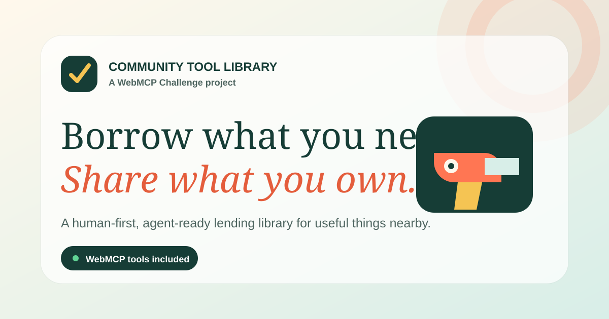

# Community Tool Library — WebMCP



A human-first, agent-ready lending library for useful things nearby. People can browse, list, reserve, and manage shared tools through the visible web interface; browser agents can perform the same workflows through structured WebMCP tools.

Built for [The WebMCP Challenge](https://webmcp.devpost.com/).

## Why this is a strong WebMCP use case

Finding a suitable community tool is a multi-step task: translate an informal job into a tool type, narrow by location and deposit, check dates, compare options, and prepare a reservation. Conventional browser automation must infer every button and field. This project exposes explicit tools with typed schemas while keeping the live interface, current session, and human approval in the loop.

Example request:

> Find a highly rated cordless drill within 5 km, available tomorrow, with a deposit below ₹600.

The agent can call `search_community_tools`, `check_tool_availability`, and `reserve_tool`. The reservation pauses at a visible approval dialog before state changes.

## Working features

- Responsive catalogue with task-based search, category, distance, and availability filters.
- Eight illustrated community listings with owner, condition, rating, distance, price, deposit, and care details.
- Date-aware reservations with overlap protection.
- Visible human confirmation before agent or user reservations and cancellations.
- “My borrowing” view with reservation source and status.
- Approval-oriented listing tool that fills a visible form and waits for manual review and publication.
- Local-first persistence and a one-click demo reset.
- Built-in guided agent demonstration that uses the same tool handlers as native WebMCP.
- PWA manifest, offline app shell, strict content-security policy, responsive navigation, keyboard focus states, and reduced-motion support.

## WebMCP implementation

The imperative tools are registered through `document.modelContext.registerTool()` in [`js/webmcp.js`](./js/webmcp.js).

| Tool | State | Purpose |
| --- | --- | --- |
| `search_community_tools` | Read-only | Search by task, category, distance, deposit, and dates; update the visible catalogue. |
| `get_tool_details` | Read-only | Return one listing’s owner, condition, rules, price, and availability. |
| `check_tool_availability` | Read-only | Validate an inclusive date range before booking. |
| `reserve_tool` | Write | Prepare a reservation, then wait for visible human approval. |
| `list_my_reservations` | Read-only | Return current and previous reservations. |
| `cancel_reservation` | Write | Prepare a cancellation, then wait for visible human approval. |
| `list_community_tool` | Write | Populate the visible listing form; the user manually publishes it. |

Read-only and untrusted-content annotation hints are included following the current WebMCP security guidance. Tool descriptions and outputs stay within the recommended character budgets. Tools are same-origin only.

## Run locally

No dependency installation or build step is required.

```bash
python3 -m http.server 4173
```

Open [http://localhost:4173](http://localhost:4173).

To run the automated checks:

```bash
node --check js/data.js
node --check js/utils.js
node --check js/store.js
node --check js/webmcp.js
node --check js/app.js
node --test
```

Node.js 20 or newer is recommended.

## Test WebMCP

Use either:

1. ChatGPT’s in-app browser using GPT-5.6 Sol or Terra with Site Tools enabled; or
2. Google Chrome 149 or later with `chrome://flags/#enable-webmcp-testing` enabled, followed by a browser restart.

Open the app and ask the browser agent to search for a shared tool. If WebMCP is unavailable, the status reads **Preview** and the “Run the guided agent demo” button exercises the exact same definitions locally.

Chrome DevTools can inspect registered tools under **Application → WebMCP**.

## Architecture

```text
Visible UI and forms
        │
        ├── store.js ── localStorage, search, availability, reservations
        │
        └── webmcp.js ── typed tool definitions and registration
                 │
        Browser agent / local demo runner
```

The project deliberately has no runtime framework or external dependency. This keeps the judged build reproducible, quick to load, easy to host, and simple to audit.

## Project structure

```text
assets/                 Original SVG identity and social preview
docs/                   Architecture, demo, and evaluation notes
js/data.js              Seed listings and original SVG tool artwork
js/store.js             State, validation, persistence, and availability
js/webmcp.js            Imperative WebMCP tool definitions and registration
js/app.js               Accessible interface and human-confirmation flows
tests/                  Node contract and behavior tests
index.html              Human UI and agent-prepared listing form
styles.css              Responsive visual system
service-worker.js       Offline app-shell cache
```

## Security and trust boundaries

- All state-changing agent tools are marked non-read-only and require a visible confirmation.
- Search outputs containing community content use `untrustedContentHint`.
- User-entered content is length-limited and HTML-escaped before rendering.
- Tool outputs are capped at 1,400 characters.
- No cross-origin tool exposure is configured.
- Exact pickup addresses, credentials, payments, and sensitive personal data are not collected.
- A restrictive content-security policy limits scripts, styles, images, connections, and workers to this origin.

See [`SECURITY.md`](./SECURITY.md) for the prototype threat model.

## Honest prototype boundaries

This hackathon build uses realistic local demo data and browser storage. It does **not** claim to provide production authentication, payments, identity verification, real geolocation, messaging, or multi-device synchronization. A production rollout would add a server-side authorization layer, verified community membership, moderation, auditing, and durable storage without changing the WebMCP interaction model demonstrated here.

## Deployment

Live production site: [community-tool-library-webmcp.vercel.app](https://community-tool-library-webmcp.vercel.app/)

The GitHub Actions workflow runs the full JavaScript and WebMCP contract test suite on every push to `main`. The production build is hosted on Vercel, with this public repository as the source of truth.

## Documentation

- [Architecture and decisions](./docs/architecture.md)
- [Three-minute demo script](./docs/demo-script.md)
- [WebMCP evaluation scenarios](./docs/webmcp-evals.md)

## License

[MIT](./LICENSE) © 2026 Jerome Prakash
